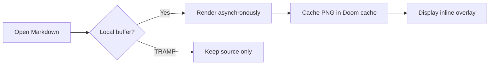

# Mermaid in Markdown

This fenced block is rendered as a live overlay without changing this file.
Use `SPC m m` to toggle previews, `SPC m M` to render the visible window once,
`SPC m v` to toggle a pristine reading view, or `C-c '` inside the fence to edit
it in `mermaid-mode`.

