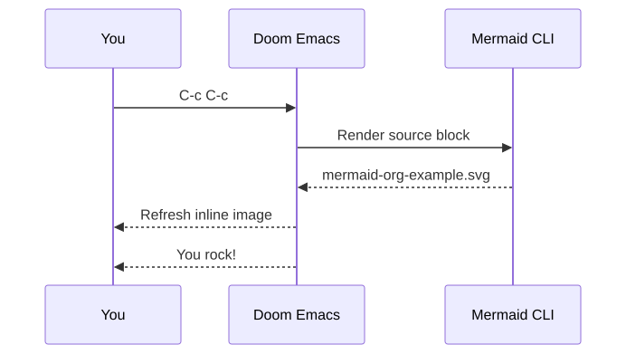

#+title: Mermaid in Org
#+startup: inlineimages

This diagram is an Org Babel source block. Put point inside it and press
=C-c C-c= or =SPC m M= to regenerate the SVG and refresh it inline.

#+begin_src mermaid :file mermaid-org-example.svg
sequenceDiagram
    participant U as You
    participant E as Doom Emacs
    participant M as Mermaid CLI
    U->>E: C-c C-c
    E->>M: Render source block
    M-->>E: mermaid-org-example.svg
    E-->>U: Refresh inline image
    E-->>U: You rock!
#+end_src

#+RESULTS:

